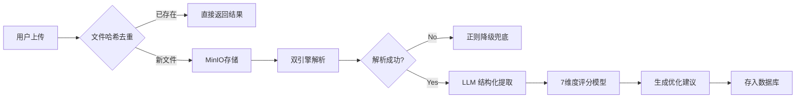
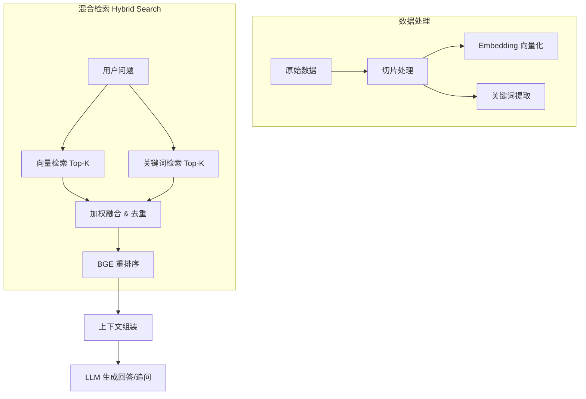
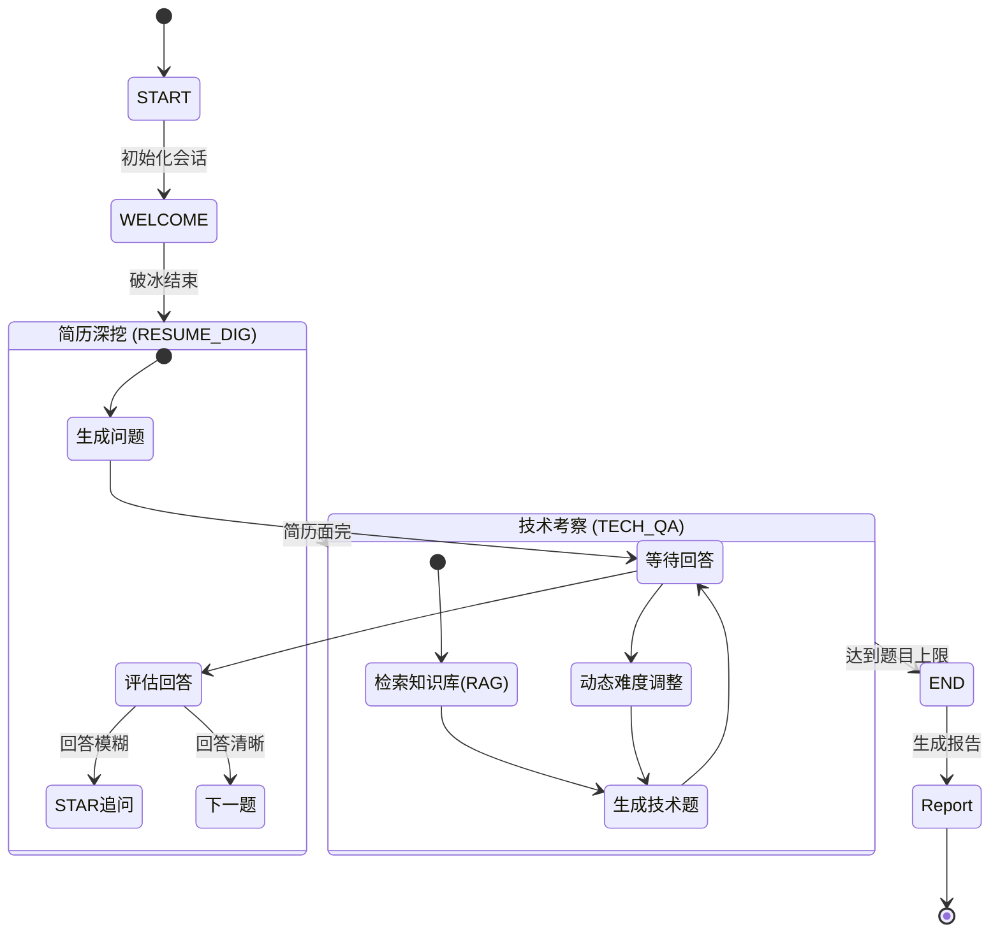

# 面霸 (Mianshibao) - 全栈 AI 面试备战平台

**面霸 (Mianshibao)** 是一个基于大语言模型 (LLM) 的全方位面试准备平台。它利用最前沿的 AI 技术，为求职者提供从简历优化、知识点查漏补缺到全真模拟面试的一站式解决方案。

---

## 🏗️ 系统架构与技术栈

本项目采用前后端分离架构，后端基于 Python FastAPI 构建高性能 API 服务，前端使用 Next.js 提供流畅的交互体验，底层利用 PostgreSQL + pgvector 存储业务数据与向量数据。

### 技术栈一览

| 领域 | 技术组件 | 说明 |
| :--- | :--- | :--- |
| **后端框架** | **Python 3.10+**, **FastAPI** | 高性能异步 Web 框架，支持自动生成 OpenAPI 文档 |
| **前端框架** | **Next.js 14**, **React**, **TypeScript** | 服务端渲染 (SSR) 与静态生成 (SSG)，类型安全 |
| **数据库** | **PostgreSQL 15+** | 关系型数据存储 |
| **向量数据库** | **pgvector** | PostgreSQL 插件，支持高效的向量相似度检索 |
| **ORM** | **SQLAlchemy 2.0 (Async)** | 现代化的异步 ORM，支持声明式映射 |
| **AI/LLM** | **LangChain**, **LangGraph** | 用于构建 LLM 应用、Agent 和状态机工作流 |
| **模型服务** | **Aliyun DashScope (Qwen)** | 通义千问大模型，提供强大的语义理解与生成能力 |
| **任务队列** | **Celery** (可选), **Redis** | 异步任务处理与缓存 |
| **部署运维** | **Docker**, **Docker Compose** | 容器化部署，一键启动 |

---

## 🔌 API 接口概览

项目核心 API 分为以下四大模块。详细接口定义请参考 `docs/api.md` 或启动后的 Swagger 文档 (`/docs`)。

### 1. 认证模块 (`/api/v1/auth`)
*   `POST /login`: 用户 JWT 登录
*   `POST /refresh`: 刷新访问令牌
*   `POST /register`: 用户注册

### 2. 简历模块 (`/api/v1/resumes`)
*   `POST /upload`: 上传简历文件 (PDF/Word)
*   `POST /{id}/parse`: 触发简历解析任务
*   `POST /{id}/score`: 执行 7 维度简历评分
*   `POST /{id}/optimize`: 生成 STAR 法则优化建议

### 3. 知识库模块 (`/api/v1/knowledge`)
*   `POST /ingest`: 知识点批量导入与向量化
*   `POST /search`: 混合检索 (Hybrid Search) API
*   `POST /ask`: 基于 RAG 的知识问答助手

### 4. 面试模块 (`/api/v1/interview`)
*   `POST /sessions`: 创建新的面试会话
*   `WS /ws/{session_id}`: WebSocket 实时语音/文本面试通道
*   `GET /sessions/{id}/report`: 生成面试综合评估报告

---

## 🌟 核心功能模块

### 1. 简历智能评分 (Resume Scoring)

系统通过多维度分析算法，对用户上传的简历进行深度解析与评分，并提供针对性的优化建议。

#### 📊 核心流程


#### 💡 技术亮点
*   **双引擎解析策略**：采用 "LLM + 正则表达式" 双重保障。优先使用大模型进行语义提取，若解析失败或超时，自动降级为正则提取关键信息（如手机号、邮箱、学历），确保系统高可用。
*   **SHA-256 哈希去重**：秒级识别重复简历，避免重复计算，节省 Token 消耗。
*   **结构化输出**：强制 LLM 输出标准 Pydantic Schema JSON，解决大模型输出不稳定的问题。

### 2. 知识点与 RAG 检索 (Knowledge RAG)

构建垂直领域的面试知识图谱，通过检索增强生成 (RAG) 技术，为用户提供精准的技术问题解答与面试追问素材。

#### 🧠 检索架构


#### 💡 技术亮点
*   **混合检索 (Hybrid Search)**：结合 **语义检索 (Vector)** 与 **关键词匹配 (BM25/FTS)**，既能理解"并发现象"等抽象概念，也能精准匹配"Redis"等专有名词。
*   **重排序 (Reranking)**：引入 rerank 模型对召回结果进行二次精排，显著提升 Top-3 结果的准确率，减少 LLM 幻觉。
*   **动态知识库**：支持知识点的新增、修改于实时向量更新。

### 3. 状态机驱动的模拟面试 (Mock Interview)

基于 LangGraph 实现的复杂对话状态机，能够像真人面试官一样控场，根据候选人的表现动态调整问题难度与方向。

#### 🤖 面试状态流转


#### 💡 技术亮点
*   **LangGraph 状态机**：摒弃传统的线性对话逻辑，采用图结构管理面试状态。支持断点续传、状态回滚与复杂的分支跳转（如发现候选人作弊或回答极差，提前终止面试）。
*   **动态难度调整**：实时分析候选人回答质量，动态升降题目的难度（Easy -> Hard），真实还原面试压迫感。
*   **STAR 法则追问**：识别回答中的 S(情境)、T(任务)、A(行动)、R(结果) 要素，针对缺失部分自动发起追问。

---

## 🚀 部署指南

本项目的部署依赖 Docker 与 Docker Compose，确保你的环境中已安装它们。

### 1. 环境准备

克隆项目代码：
```bash
git clone https://github.com/your-repo/mianshibao.git
cd mianshibao
```

### 2. 配置环境变量

复制环境配置文件示例并填写你的 API Key（主要需要阿里云 DashScope Key）：

```bash
# 后端配置
cd backend
cp .env.example .env
# 编辑 .env 文件，填入 DASHSCOPE_API_KEY, DATABASE_URL 等信息

# 前端配置 (通常构建时需要)
cd ../frontend
cp .env.example .env.local
```

### 3. 使用 Docker Compose 启动

并在项目根目录运行：

```bash
docker-compose up -d --build
```

### 4. 数据初始化 (首次运行)

启动后，需要初始化数据库结构并导入基础知识库数据：

```bash
# 进入后端容器
docker-compose exec backend bash

# 运行数据库迁移
alembic upgrade head

# 导入示例知识库数据
python scripts/ingest_knowledge.py
```

### 5. 访问服务

*   **前端页面**: [http://localhost:3000](http://localhost:3000)
*   **后端 API 文档**: [http://localhost:8000/docs](http://localhost:8000/docs)
*   **MinIO 控制台**: [http://localhost:9001](http://localhost:9001)

---

## 📄 版权说明

本项目采用 MIT 协议开源。欢迎提交 Issue 与 Pull Request。
